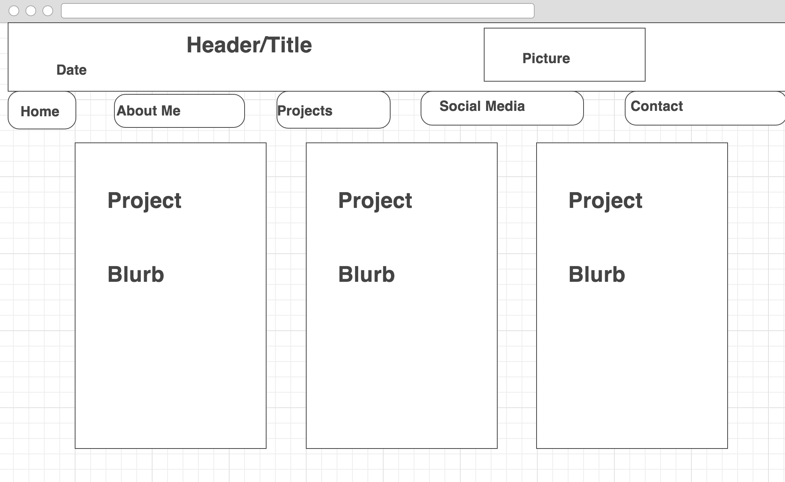
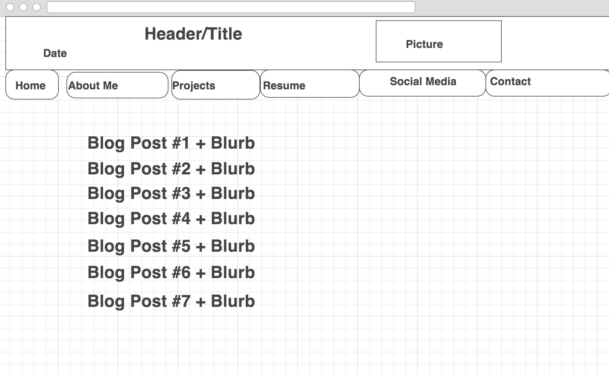

<!--my website index-->

<!--blog index-->

What is a wireframe?
A wireframe is a skeleton framework of how a website will be laid out, like a blueprint. It allows you to visualize the website and try to plan a visual journey through your site without being distracted by the colors and content that will eventually be there. It's not a sitemap, which shows the journey from one page to the next, but would be used in conjunction with one to show what they look at one each stage of their journey through the site, using the wireframe for each page and the sitemap for navigation.

What are the benefits of wireframing?
Wireframing allows you to conceptualize and consider elements of the site before you actually put them together, so you can imagine the layout before it gets filled with distractions. You can change the layout easily if you change your mind about something, and experiment with different navigation systems so that when you finally start coding, you can be more sure that it will be what you want. 

Did you enjoy wireframing your site?
I did not particularly enjoy wireframing. It's not something that I'm particularly apt at, and looking at wireframes didn't serve to inspire me particularly. Design has never been a particular strength of mine, and I'm much more interested in doing back end than front end development, at least for now. It's likely that as I read and practice more I'll change my mind about this, but for now it's just a high-friction process for me.

Did you revise your wireframe or stick with your first idea?
I revised my wireframes once each after creating my initial idea.

What questions did you ask during this challenge? What resources did you find to help you answer them?
I used wireframe.cc, which is a lightweight, free wireframing tool.

Which parts of the challenge did you enjoy and which parts did you find tedious?
I enjoy the HTML coding for inline images - as I start to get better with html I enjoy it more and more. However, as I said before, I didn't enjoy the wireframing process, as it's a grinding process for me. 